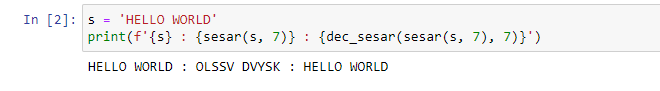

---
# Front matter
title: "Отчёт по лабораторной работе №1"
subtitle: "Шифр простой замены"
author: "Залина Арсоева"

# Generic otions
lang: ru-RU
toc-title: "Содержание"

# Bibliography
bibliography: bib/cite.bib
csl: pandoc/csl/gost-r-7-0-5-2008-numeric.csl

# Pdf output format
toc: true # Table of contents
toc_depth: 2
lof: true # List of figures
fontsize: 12pt
linestretch: 1.5
papersize: a4
documentclass: scrreprt
## I18n
polyglossia-lang:
  name: russian
  options:
	- spelling=modern
	- babelshorthands=true
polyglossia-otherlangs:
  name: english
### Fonts
mainfont: PT Serif
romanfont: PT Serif
sansfont: PT Sans
monofont: PT Mono
mainfontoptions: Ligatures=TeX
romanfontoptions: Ligatures=TeX
sansfontoptions: Ligatures=TeX,Scale=MatchLowercase
monofontoptions: Scale=MatchLowercase,Scale=0.9
## Biblatex
biblatex: true
biblio-style: "gost-numeric"
biblatexoptions:
  - parentracker=true
  - backend=biber
  - hyperref=auto
  - language=auto
  - autolang=other*
  - citestyle=gost-numeric
## Misc options
indent: true
header-includes:
  - \linepenalty=10 # the penalty added to the badness of each line within a paragraph (no associated penalty node) Increasing the value makes tex try to have fewer lines in the paragraph.
  - \interlinepenalty=0 # value of the penalty (node) added after each line of a paragraph.
  - \hyphenpenalty=50 # the penalty for line breaking at an automatically inserted hyphen
  - \exhyphenpenalty=50 # the penalty for line breaking at an explicit hyphen
  - \binoppenalty=700 # the penalty for breaking a line at a binary operator
  - \relpenalty=500 # the penalty for breaking a line at a relation
  - \clubpenalty=150 # extra penalty for breaking after first line of a paragraph
  - \widowpenalty=150 # extra penalty for breaking before last line of a paragraph
  - \displaywidowpenalty=50 # extra penalty for breaking before last line before a display math
  - \brokenpenalty=100 # extra penalty for page breaking after a hyphenated line
  - \predisplaypenalty=10000 # penalty for breaking before a display
  - \postdisplaypenalty=0 # penalty for breaking after a display
  - \floatingpenalty = 20000 # penalty for splitting an insertion (can only be split footnote in standard LaTeX)
  - \raggedbottom # or \flushbottom
  - \usepackage{float} # keep figures where there are in the text
  - \floatplacement{figure}{H} # keep figures where there are in the text
---

# Цель работы

Изучение алгоритмов шифрования Цезаря и Атбаш

# Теоретические сведения

## Шифр Цезаря

Шифр Цезаря, также известный, как шифр сдвига, код Цезаря или сдвиг Цезаря — один из самых простых и наиболее широко известных методов шифрования.

Шифр Цезаря — это вид шифра подстановки, в котором каждый символ в открытом тексте заменяется символом находящимся на некотором постоянном числе позиций левее или правее него в алфавите. Например, в шифре со сдвигом 3 А была бы заменена на Г, Б станет Д, и так далее.

Шифр назван в честь римского императора Гая Юлия Цезаря, использовавшего его для секретной переписки со своими генералами.

Шаг шифрования, выполняемый шифром Цезаря, часто включается как часть более сложных схем, таких как шифр Виженера, и все ещё имеет современное приложение в системе ROT13. Как и все моноалфавитные шифры, шифр Цезаря легко взламывается и не имеет практически никакого применения на практике.

Если сопоставить каждому символу алфавита его порядковый номер (нумеруя с 0), то шифрование и дешифрование можно выразить формулами модульной арифметики:

```
y = (x + k) mod n
x = (y - k + n) mod n
```

где
*x — символ открытого текста,
*y — символ шифрованного текста
*n — мощность алфавита
*k — ключ.

С точки зрения математики шифр Цезаря является частным случаем аффинного шифра.

## Шифр Атбаш

Атбаш — простой шифр подстановки, изначально придуманный для иврита. Правило шифрования состоит в замене i-й буквы алфавита буквой с номером n − i + 1, где n — число букв в алфавите.

# Выполнение работы

## Реализация шифра Цезаря на языке Python

Блок шифрования

```
# функция шифрования по алгоритму цезаря
def sesar():
    letters = 'ABCDEFGHIJKLMNOPQRSTUVWXYZABCDEFGHIJKLMNOPQRSTUVWXYZ'
    step = 5
    text = input('Тект для шифровки ')
    result = ''
    for i in text:
        ind = letters.find(i)
        newind = ind + step
        if i in letters:
            result += letters[newind]
        else:
            result += i
    print(result)
```

Блок дешифровки

```
def sesar_dec():
    letters = 'ABCDEFGHIJKLMNOPQRSTUVWXYZABCDEFGHIJKLMNOPQRSTUVWXYZ'
    step = 5
    text = input('Текст для дешивровки: ')
    result = ''
    for i in text:
        ind = letters.find(i)
        newind = ind - step
        if i in letters:
            result += letters[newind]
        else:
            result += i
    print(result)
```

## Реализация шифра Атбаш на языке Python

Блок шифрования

```
def atbash():
    letters = 'ABCDEFGHIJKLMNOPQRSTUVWXYZ'
    letters_r = [x for x in letters]
    letters_r.reverse()

    text = input("Тект для шифровки")
    result = ""
    for i in text:
        for j,l in enumerate(letters):
            if i == l:
                result += letters_r[j]
    print(result)
```

Блок дешифровки

```
def atbash_dec():
    letters = 'ABCDEFGHIJKLMNOPQRSTUVWXYZ'
    letters_r = [x for x in letters]
    letters_r.reverse()
    text = input('Тект для дешифровки ')
    result = ''
    for i in text:
        for j, l in enumerate(letters_r):
            if i == l:
                result += letters[j]
    print(result)
```

## Контрольный пример

{ #fig:001 width=70% height=70%}

{ #fig:002 width=70% height=70%}


# Выводы

Изучили алгоритмы шифрования Цезаря и Атбаш.

# Список литературы{.unnumbered}

1. [Шифр Цезаря](https://habr.com/ru/post/534058/)
2. [Шифр Атбаш](https://habr.com/ru/post/444176/)
