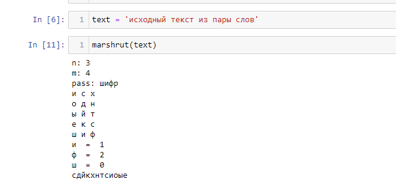
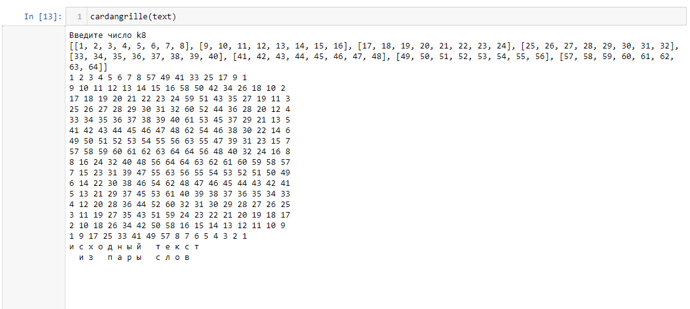
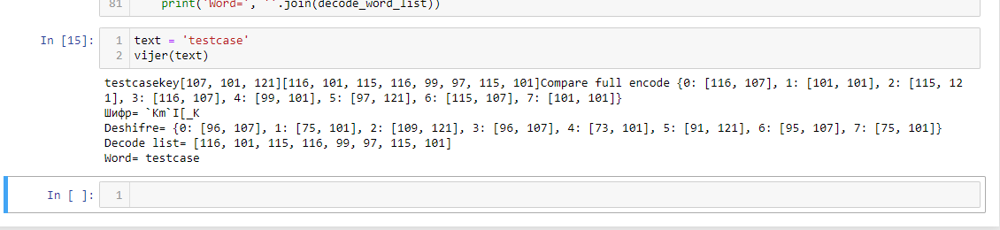

---
## Front matter
lang: ru-RU
title: Шифры перестановки
author: Залина Арсоева
institute: Российский Университет Дружбы Народов
date: 19 сентября, 2025, Москва, Россия

## Formatting
mainfont: PT Serif
romanfont: PT Serif
sansfont: PT Sans
monofont: PT Mono
toc: false
slide_level: 2
theme: metropolis
header-includes: 
 - \metroset{progressbar=frametitle,sectionpage=progressbar,numbering=fraction}
 - '\makeatletter'
 - '\beamer@ignorenonframefalse'
 - '\makeatother'
aspectratio: 43
section-titles: true

---

# Цели и задачи

## Цель лабораторной работы

Изучение алгоритмов маршрутной перестановки, решеток и Виженера

# Выполнение лабораторной работы

## Шифр маршрутной перестановки

Данный шифр относится к классу шифров перестановки и характеризуется простотой выполнения операций шифрова- ния/расшифрования. Один из наиболее распространенных способов шифрования/расшифрования задается некоторым прямоугольником (таблицей) и соответствующим правилом его заполнения. Например, открытый текст записывается в таблицу по строкам, а шифртекст получается в результате выписывания столбцов соответствующей таблицы, или наоборот.

## Шифр Кардано

Решетка Кардано — это ключ к секретному посланию, как правило, специальная карточка, в которой в определенных местах имеются прорези — ячейки. Чтение зашифрованного послания происходит при наложении на кодированный текст.
Данный метод придуман в 16 веке итальянским математиком Джероламо Кардано.

## Шифр Виженера

Шифр Виженера — это метод шифровки, в котором используются различные «шифры Цезаря» на основе букв в ключевом слове. В шифре Цезаря каждую букву абзаца необходимо поменять местами с определенным количеством букв, чтобы заменить исходную букву. Например, в латинском алфавите А становится D, B становится Е, С становится F. Шифр Виженера построен на методе использования различных шифров Цезаря в различных частях сообщения.

## Контрольный пример

{ #fig:001 width=70% height=70%}

## Контрольный пример

{ #fig:002 width=70% height=70%}

## Контрольный пример

{ #fig:003 width=70% height=70%}

# Выводы

## Результаты выполнения лабораторной работы

Изучили алгоритмы шифрования с помощью перестановок