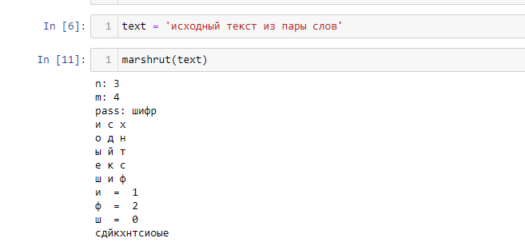
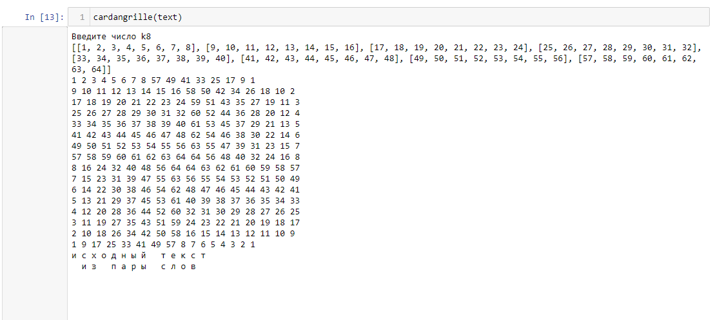
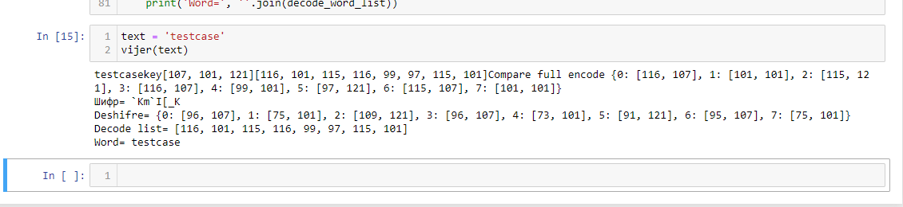

---
# Front matter
title: "Отчёт по лабораторной работе №2"
subtitle: "Шифры перестановки"
author: "Залина Арсоева"

# Generic otions
lang: ru-RU
toc-title: "Содержание"

# Bibliography
bibliography: bib/cite.bib
csl: pandoc/csl/gost-r-7-0-5-2008-numeric.csl

# Pdf output format
toc: true # Table of contents
toc_depth: 2
lof: true # List of figures
fontsize: 12pt
linestretch: 1.5
papersize: a4
documentclass: scrreprt
## I18n
polyglossia-lang:
  name: russian
  options:
	- spelling=modern
	- babelshorthands=true
polyglossia-otherlangs:
  name: english
### Fonts
mainfont: PT Serif
romanfont: PT Serif
sansfont: PT Sans
monofont: PT Mono
mainfontoptions: Ligatures=TeX
romanfontoptions: Ligatures=TeX
sansfontoptions: Ligatures=TeX,Scale=MatchLowercase
monofontoptions: Scale=MatchLowercase,Scale=0.9
## Biblatex
biblatex: true
biblio-style: "gost-numeric"
biblatexoptions:
  - parentracker=true
  - backend=biber
  - hyperref=auto
  - language=auto
  - autolang=other*
  - citestyle=gost-numeric
## Misc options
indent: true
header-includes:
  - \linepenalty=10 # the penalty added to the badness of each line within a paragraph (no associated penalty node) Increasing the value makes tex try to have fewer lines in the paragraph.
  - \interlinepenalty=0 # value of the penalty (node) added after each line of a paragraph.
  - \hyphenpenalty=50 # the penalty for line breaking at an automatically inserted hyphen
  - \exhyphenpenalty=50 # the penalty for line breaking at an explicit hyphen
  - \binoppenalty=700 # the penalty for breaking a line at a binary operator
  - \relpenalty=500 # the penalty for breaking a line at a relation
  - \clubpenalty=150 # extra penalty for breaking after first line of a paragraph
  - \widowpenalty=150 # extra penalty for breaking before last line of a paragraph
  - \displaywidowpenalty=50 # extra penalty for breaking before last line before a display math
  - \brokenpenalty=100 # extra penalty for page breaking after a hyphenated line
  - \predisplaypenalty=10000 # penalty for breaking before a display
  - \postdisplaypenalty=0 # penalty for breaking after a display
  - \floatingpenalty = 20000 # penalty for splitting an insertion (can only be split footnote in standard LaTeX)
  - \raggedbottom # or \flushbottom
  - \usepackage{float} # keep figures where there are in the text
  - \floatplacement{figure}{H} # keep figures where there are in the text
---

# Цель работы

Изучение алгоритмов маршрутной перестановки, решеток и Виженера

# Теоретические сведения

## Шифр маршрутной перестановки

Широкое распространение получили шифры перестановки, использующие некоторую геометрическую фигуру. Преобразования из этого шифра состоят в том, что в фигуру исходный текст вписывается по ходу одного ``маршрута'', а затем по ходу другого выписывается с нее. Такой шифр называют маршрутной перестановкой. Например, можно вписывать исходное сообщение в прямоугольную таблицу, выбрав такой маршрут: по горизонтали, начиная с левого верхнего угла поочередно слева направо и справа налево. Выписывать же сообщение будем по другому маршруту: по вертикали, начиная с верхнего правого угла и двигаясь поочередно сверху вниз и снизу вверх.

## Шифр Кардано

Решётка Кардано — инструмент кодирования и декодирования, представляющий собой специальную прямоугольную (в частном случае — квадратную) таблицу-карточку, четверть ячеек которой вырезана.

Таблица накладывается на носитель, и в вырезанные ячейки вписываются буквы, составляющие сообщение. После переворачивания таблицы вдоль вертикальной оси, процесс вписывания букв повторяется. Затем то же самое происходит после переворачивания вдоль горизонтальной и снова вдоль вертикальной осей.

В частном случае квадратной таблицы, для получения новых позиций для вписывания букв, можно поворачивать квадрат на четверть оборота.

Чтобы прочитать закодированное сообщение, необходимо наложить решётку Кардано нужное число раз на закодированный текст и прочитать буквы, расположенные в вырезанных ячейках.

Такой способ шифрования сообщения был предложен математиком Джероламо Кардано в 1550 году, за что и получил своё название.

## Шифр Виженера

Шифр Виженера (фр. Chiffre de Vigenère) — метод полиалфавитного шифрования буквенного текста с использованием ключевого слова.

Этот метод является простой формой многоалфавитной замены. Шифр Виженера изобретался многократно. Впервые этот метод описал Джован Баттиста Беллазо (итал. Giovan Battista Bellaso) в книге La cifra del. Sig. Giovan Battista Bellasо в 1553 году, однако в XIX веке получил имя Блеза Виженера, французского дипломата. Метод прост для понимания и реализации, он является недоступным для простых методов криптоанализа.

В шифре Цезаря каждая буква алфавита сдвигается на несколько строк; например в шифре Цезаря при сдвиге +3, A стало бы D, B стало бы E и так далее. Шифр Виженера состоит из последовательности нескольких шифров Цезаря с различными значениями сдвига. Для зашифровывания может использоваться таблица алфавитов, называемая tabula recta или квадрат (таблица) Виженера. Применительно к латинскому алфавиту таблица Виженера составляется из строк по 26 символов, причём каждая следующая строка сдвигается на несколько позиций. Таким образом, в таблице получается 26 различных шифров Цезаря. На каждом этапе шифрования используются различные алфавиты, выбираемые в зависимости от символа ключевого слова.

# Выполнение работы

## Реализация шифра маршрутной перестановки на языке Python

```
import sys

def prrint(lists):
    for i in lists:
        for j in i:
            print(j, end=" ")
        print()
		
def marshrut(text):
    text = text.replace(' ', '')
    n = int(input('n: '))
    m = int(input('m: '))
    parol = input('pass: ')
    lists = [['a' for i in range(0, n)] for j in range(m)]
    it = 0
    for i in range(m):
        for j in range(n):
            if it < len(text):
                lists[i][j] = text[it]
                it += 1
    lis = list()
    for i in range(n):
        lis.append(parol[i])
    lists.append(lis)
    prrint(lists)
    result = ''
    spisok = sorted(lists[len(lists)-1])
    for i in spisok:
        print(i, " = ", lists[len(lists)-1].index(i))
        for j in range(len(lists)):
            if j==len(lists)-1:
                continue
            result += lists[j][lists[len(lists)-1].index(i)]
    print(result)
```

## Реализация шифра решеткой на языке Python

```
def rot90(matrix):
    return[list(reversed(col)) for col in zip(*matrix)]

def udalenie(largelist, inn, k):
    for i in range(k * 2):
        for j in range(k * 2):
            if largelist[i][j] == inn:
                largelist[i][j] = " "
                return

            
def cardangrille(text):
    k = int(input("Введите число k"))
    s=1
    lists = [[i for i in range(k)] for i in range(k)]
    for i in range(k):
        for j in range(k):
            lists[i][j] = s
            s += 1
    print(lists)
    lists1 = rot90(lists)
    lists2 = rot90(lists1)
    lists3 = rot90(lists2)
    largelist = [[1 for i in range(2*k)] for i in range(2*k)]
    for i in range(k):
        for j in range(k):
            largelist[i][j] = lists[i][j]
    i1 = 0
    j1 = 0
    for i in range(0, k):
        for j in range(k, k*2):
            largelist[i][j] = lists1[i1][j1]
            j1 += 1
        j1 = 0
        i1 += 1
    i1 = 0
    j1 = 0
    for i in range(k, k*2):
        for j in range(k, k * 2):
            largelist[i][j] = lists2[i1][j1]
            j1 += 1
        j1 = 0
        i1 += 1
    i1 = 0
    j1 = 0
    for i in range(k, k * 2):
        for j in range(0, k):
            largelist[i][j] = lists3[i1][j1]
            j1 += 1
        j1 = 0
        i1 += 1
    prrint(largelist)
    largelist_a = [[" " for i in range(2*k)] for i in range(2*k)]
    s = 0
    li = [i for i in range(1,k**2+1)]
    for inn in li:
        udalenie(largelist, inn, k)
    ind = 0
    for i in range(k * 2):
        for j in range(k * 2):
            if largelist[i][j] == largelist_a[i][j] and len(text) > 0:
                largelist_a[i][j] = text[0]
                text = text[1:]
    largelist = rot90(largelist)
    for i in range(k * 2):
        for j in range(k * 2):
            if largelist[i][j] == largelist_a[i][j] and len(text) > 0:
                largelist_a[i][j] = text[0]
                text = text[1:]
    if len(text) > 0:
        largelist = rot90(largelist)
        for i in range(k * 2):
            for j in range(k * 2):
                if largelist[i][j] == largelist_a[i][j] and len(text) > 0:
                    largelist_a[i][j] = text[0]
                    text = text[1:]
    if len(text) > 0:
        largelist = rot90(largelist)
        for i in range(k * 2):
            for j in range(k * 2):
                if largelist[i][j] == largelist_a[i][j] and len(text) > 0:
                    largelist_a[i][j] = text[0]
                    text = text[1:]                    
    prrint(largelist_a)
    stri = input("Введите пароль")
    if len(stri) > k*2:
        stri = stri[:k*2]
    elif len(stri) < k*2:
        while len(stri) != k*2:
            stri += "z"
    largelist_a.append(list(stri))
    prrint(largelist_a)
    result = ""
    spisok = sorted(largelist_a[len(largelist_a) - 1])
    for i in spisok:
        print(i, " = ", largelist_a[len(largelist_a) - 1].index(i))
        for j in range(len(largelist_a)):
            if j==len(largelist_a)-1:
                continue
            result += largelist_a[j][largelist_a[len(largelist_a) - 1].index(i)]
    print(result.replace(" ", ""))
```

## Реализация шифра Виженера на языке Python

```
def form_dict():
    d = {}
    iter = 0
    for i in range(0,127):
        d[iter] = chr(i)
        iter = iter +1
    return d

def encode_val(word):
    list_code = []
    lent = len(word)
    d = form_dict()

    for w in range(lent):
        for value in d:
            if word[w] == d[value]:
               list_code.append(value)
    return list_code

def comparator(value, key):
    len_key = len(key)
    dic = {}
    iter = 0
    full = 0

    for i in value:
        dic[full] = [i,key[iter]]
        full = full + 1
        iter = iter +1
        if (iter >= len_key):
            iter = 0
    return dic

def full_encode(value, key):
    dic = comparator(value, key)
    print('Compare full encode', dic)
    lis = []
    d = form_dict()

    for v in dic:
        go = (dic[v][0]+dic[v][1]) % len(d)
        lis.append(go)
    return lis

def decode_val(list_in):
    list_code = []
    lent = len(list_in)
    d = form_dict()

    for i in range(lent):
        for value in d:
            if list_in[i] == value:
               list_code.append(d[value])
    return list_code

def full_decode(value, key):
    dic = comparator(value, key)
    print('Deshifre=', dic)
    d = form_dict()
    lis =[]

    for v in dic:
        go = (dic[v][0]-dic[v][1]+len(d)) % len(d)
        lis.append(go)
    return lis

def vijer(word):
    key = "key"
    sys.stdout.write(word)
    sys.stdout.write(key)
    key_encoded = encode_val(key)
    value_encoded = encode_val(word)
    sys.stdout.write(str(key_encoded))
    sys.stdout.write(str(value_encoded))
    shifre = full_encode(value_encoded, key_encoded)
    print('Шифр=', ''.join(decode_val(shifre)))

    decoded = full_decode(shifre, key_encoded)
    print('Decode list=', decoded)
    decode_word_list = decode_val(decoded)
    print('Word=', ''.join(decode_word_list))
```

## Контрольный пример

{ #fig:001 width=70% height=70%}

{ #fig:002 width=70% height=70%}

{ #fig:003 width=70% height=70%}

# Выводы

Изучили алгоритмы шифрования с помощью перестановок

# Список литературы{.unnumbered}

1. [Шифр маршрутной перестановки](https://life-prog.ru/2_89965_marshrutnie-perestanovki.html)
2. [Шифр Кардано](https://kabinfo.ucoz.ru/index/shifr_reshetka_kardano/0-374)
3. [Шифр Виженера](https://habr.com/ru/post/103055/)
